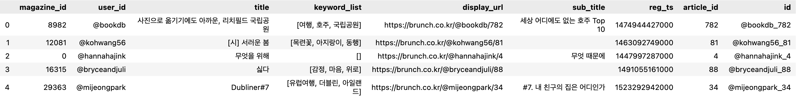
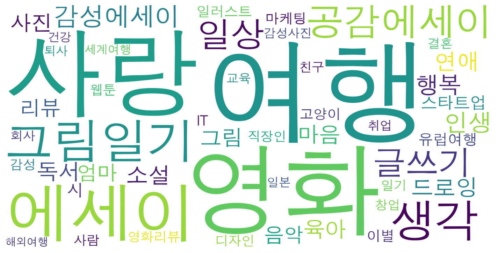
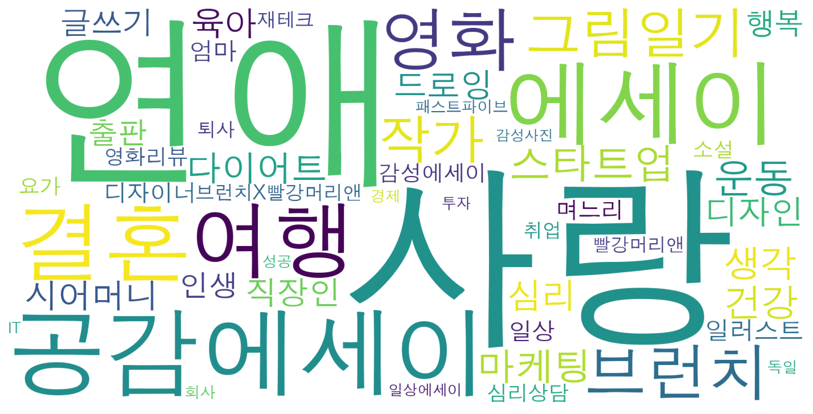

# Brunch Pick
  - [분석 목표 및 결과](#분석-목표-및-결과)
  - [활용 데이터](#활용-데이터)
  - [데이터 시각화](#데이터-시각화)
    - [작가들이 많이 사용한 키워드 목록](#작가들이-많이-사용한-키워드-목록)
    - [**독자들이 주로 구독한 작가들의 키워드 목록**](#독자들이-주로-구독한-작가들의-키워드-목록)
  - [데이터 전처리](#데이터-전처리)
  - [유사도 분석](#유사도-분석)
    - [**사용자 키워드 기반으로 유사도가 높은 작가 추천**](#사용자-키워드-기반으로-유사도가-높은-작가-추천)
    - [**구독한 작가 기반으로 유사도가 높은 작가 추천**](#구독한-작가-기반으로-유사도가-높은-작가-추천)
    - [**추천 받은 작가 기반으로 글 추천**](#추천-받은-작가-기반으로-글-추천)
  - [회고](#회고)

---

## 분석 목표 및 결과

- 자연어 처리 및 코사인 유사도 기반 추천 과정 복습 목적
- 브런치 사용자 키워드, 구독한 작가를 기반으로 코사인 유사도가 높은 작가 및 글을 추천

---

## 활용 데이터

- `metadata`: 작가 아이디, 글 제목 등의 메타데이터 정보
    
    
    
- `magazine.json`: 작가가 부여한 매거진 태그 목록과 ID 번호 정보
    
    
    
- `user.json`: 가입한 사용자 정보
    
    
    
- `read.tar`: 브런치 독자들이 본 글의 정보
    
    
    

---

## 데이터 시각화

### 작가들이 많이 사용한 키워드 목록



### **독자들이 주로 구독한 작가들의 키워드 목록**



---

## 데이터 전처리

- 메타데이터로부터 글을 많이 쓴 작가 4000명을 추출하고 빈도수가 많은 20개 키워드 목록을 정리
    
    
    

---

## 유사도 분석

### **사용자 키워드 기반으로 유사도가 높은 작가 추천**

```python
사용자 ID: #00001ba6ca8d87d2fc34d626ba9cfe6f
사용자 키워드: ['사랑', '성공', '인생', '브런치', '작가', '글쓰기', '해외취업', '취직', '싱가포르']
추천 작가: ['@singayoung', '@swimmingstar', '@brunch']
@singayoung 작가의 키워드: ['해외취업', '싱가포르', '취업', '해외', '싱가폴', '면접', '여행', '구직', '친구', '영어']
@swimmingstar 작가의 키워드: ['유럽여행', '해외취업', '싱가포르', '여행', '독일', '터키', '인생', '도서관', '베를린', '트래블라인싱가포르']
@brunch 작가의 키워드: ['브런치', '작가', '인터뷰', '브런치북', '토크콘서트', '출간', '출판', '콜라보레이션', '안내', '에디터']
```

### **구독한 작가 기반으로 유사도가 높은 작가 추천**

```python
사용자 ID: #00001ba6ca8d87d2fc34d626ba9cfe6f
구독한 작가: ['@brunch']
추천 작가: ['@siso-writers', '@thecommaa', '@theee']
@siso-writers 작가의 키워드: ['작가', '글쓰기', '출판', '편집자', '에디터', '출판사', '기획', '원고', '이벤트', '강연']
@thecommaa 작가의 키워드: ['인터뷰', '디지털노마드', '디자인', '마음', '스벅', '셰프', '수필', '패션', '작가', '에세이']
@theee 작가의 키워드: ['인터뷰', '생각', '독서모임', '스타트업', '독서', '인생', '일기', '미국', '선택', '독후감']
```

### **추천 받은 작가 기반으로 글 추천**

```python
사용자 ID: #00001ba6ca8d87d2fc34d626ba9cfe6f
구독한 작가: ['@brunch']
추천 작가: ['@siso-writers', '@thecommaa', '@theee']
추천 게시글
1. <작가를 위한 집필 안내서> 정혜윤 작가와의 인터뷰 (@siso-writers_58)
2. 내가 쓴 원고의 가치를 어떻게 따질 수 있을까? (@siso-writers_8)
3. ‘출간 방향’에 맞지 않는다는 말 (@siso-writers_18)
```

---

## 회고

- 유사도 분석을 체험할 목적으로 단순히 텍스트 출력을 확인하는데 그쳤지만,
향후 브런치 페이지를 클론 코딩하고 추천 기능을 시각적으로 추가하는 프로젝트로 발전시키면 좋을 것